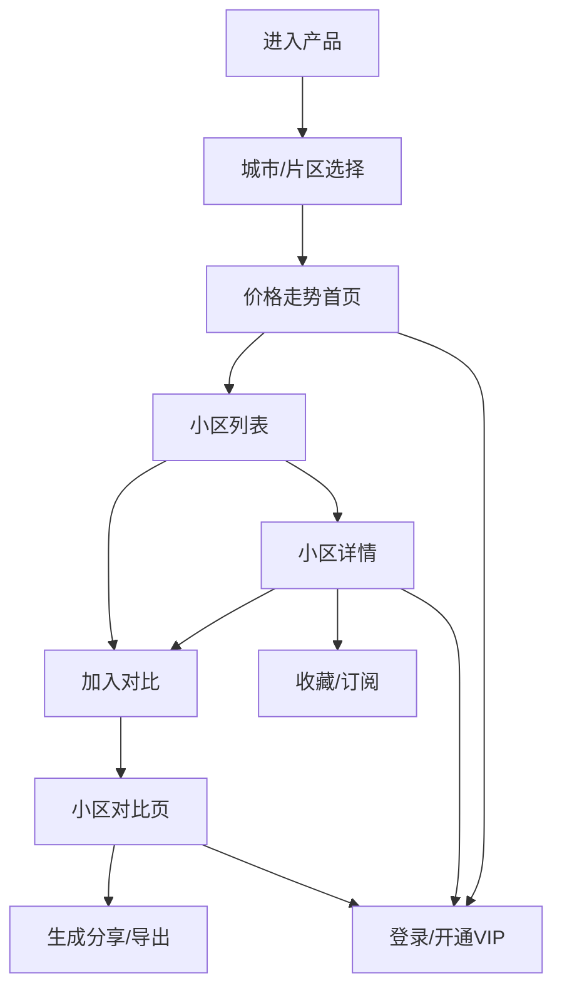
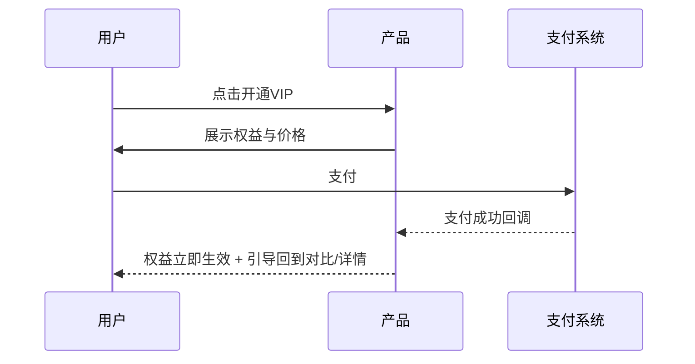

# 【生活娱乐赛道】豪斯助手 PRD
让你清楚了解本地房价走势，作出更接近“合适时机”的选择

创建日期：2026-06-16  
产品形态：Web 为主，后续可演进为小程序

## 需求识别
| 维度 | 结论 |
|---|---|
| 需求类型 | 0-to-1 产品 |
| 复杂度 | 中等（5–10 页量级） |
| 目标读者 | 产品、设计、研发、测试 |
| 行业 | 互联网消费产品（生活服务方向） |
| 风险等级 | 中（涉及数据准确性、合规与用户决策影响） |

## 背景与问题
房价信息的获取长期依赖“道听途说”和线下走访；即便使用现有软件，也常见“功能堆叠、信息割裂、对比困难”，用户要自己在多个页面、多个小区之间来回切换，决策成本高。`[PM hypothesis]`

对年轻与中年上班族来说，周末再投入大量时间看房、跑盘会非常消耗精力；如果能把“走势、对比、住户评价、周边环境”等信息聚合到一个更轻、更可对比的产品里，就能显著降低前期信息筛选成本。`[PM hypothesis]`

## 目标
### 产品目标
1. 让用户在“准备看房之前”用更少的时间看懂本地价格走势与小区差异。
2. 提供可解释的“走势量化”与“横向对比”，减少只看“当前单点价格”的误判。
3. 为后续商业化（VIP、合作导流、装修/家具权益）提供产品承载位与数据闭环。

### 不做的事
- 不承诺“预测房价涨跌”或给出投资建议（仅做信息展示与量化分析）。`[Assumption — to be确认]`
- 暂不做交易闭环（带看、签约、贷款等）。`[Assumption — to be确认]`

## 目标用户与使用场景
### 目标用户
- 有看房/买房想法，但信息不足、怕买在不合适时机的青年/中年用户。
- 时间碎片化、对比需求强、对“老小区真实居住体验”敏感的用户。

### 核心场景
1. 决策前筛选：想在正式看房前，先筛掉明显不合适的小区/片区。
2. 周末前准备：计划周末看房，提前做 3–5 个小区对比与路线规划（路线本期可不做，只做信息准备）。`[Assumption — to be确认]`
3. 老小区评估：想了解真实居住反馈、周边环境与问题点（噪音、停车、物业、采光、学区等）。

### 当前痛点
- 只知道“现在多少钱”，难量化“过去怎么走、波动多大、是否高位/低位区间”。`[PM hypothesis]`
- 住户评价难获取，线下找人问不现实。
- 对比路径复杂：同一维度（价格/环境/评价）在不同产品里分散，横向对比成本高。

## 产品定位与价值
一句话定位：**面向准备看房人群的本地房价趋势与小区对比工具**。

价值点：
- 效率：减少线上信息搜集与线下跑盘的盲目性。
- 体验：用“对比优先”的信息组织方式替代功能堆叠。
- 商业化：VIP 深度报告与优惠权益承接；未来可与地产商/家居装修合作。

## 核心信息结构
`[Assumption — to be确认]`豪斯助手信息由四类组成：
1. 价格信息：城市/片区/小区维度的时间序列（均价、成交量或挂牌量等）。
2. 走势量化：涨跌幅、波动率、阶段高低点、近 N 月趋势斜率等指标（仅展示与解释，不做预测）。
3. 居住评价：对老小区“居住体验”的结构化维度（物业、噪音、停车、采光、公共空间、通勤、配套等）。
4. 周边环境：配套与环境标签（交通、商业、医疗、公园等，展示来源需合规）。`[To be confirmed]`

## 功能需求
### 功能总览表
| # | 模块 | 功能说明 |
|---|---|---|
| 1 | 城市与区域选择 | 用户进入后选择城市与片区，系统展示该范围的价格概览与趋势摘要；支持最近使用与热门区域入口，避免首次使用无从下手。 |
| 2 | 价格走势首页 | 提供“本地整体走势 + 片区对比”的入口，默认展示近 12 个月趋势，并提供时间范围切换；每条趋势需配文字解释（例如“近 3 月缓慢上行、波动较小”）。 |
| 3 | 小区列表与筛选 | 在片区下按均价区间、建成年代、地铁距离、评分等筛选小区；列表直接呈现关键对比字段（当前均价、近 6 月涨跌、波动、评价分）。 |
| 4 | 小区详情页 | 展示小区价格时间序列、走势量化指标、居住评价维度、周边环境要点与典型问题；允许收藏、加入对比、订阅更新。 |
| 5 | 小区对比页 | 支持 2–5 个小区横向对比：价格走势叠加、关键指标对照、评价维度雷达或表格对照；输出“差异总结”供用户快速理解。 |
| 6 | 订阅与提醒 | 用户订阅片区/小区，当价格或指标变化达到阈值时提醒（站内通知或邮件/短信二选一）。`[Assumption — to be确认]` |
| 7 | 账号体系 | 支持游客浏览基础信息；登录后可收藏、对比历史、订阅；登录方式（手机号/三方）待定。`[To be confirmed]` |
| 8 | VIP 与付费墙 | VIP 解锁更深的走势拆解、更多历史区间、更细颗粒度对比、报告导出等；需明确“免费可用”边界，避免全靠付费墙。 |
| 9 | 报告导出与分享 | 将对比结果生成可分享链接或导出为图片/PDF（先做分享链接或图片）。`[Assumption — to be确认]` |
| 10 | 内容与数据后台 | 运营/管理员维护小区基础信息、评价结构、标签口径；提供数据来源与更新时间展示字段，支持下架/纠错流程。 |

### 信息架构与页面关系

### 页面级需求与原型
#### 城市与区域选择

规则与异常：
- 搜索支持城市/片区关键词；无结果时展示“换个关键词试试”空态。
- 首次进入若无定位权限：提示手动选择城市，不阻塞使用。`[Assumption — to be确认]`

#### 价格走势首页

关键逻辑：
- 趋势图下方必须有“口径说明”（数据维度、更新时间、是否挂牌/成交）。`[To be confirmed]`
- 当数据不足（例如新盘片区历史不全）：展示可用区间，并标注“历史不足”。  

#### 小区列表与筛选

规则：
- 加入对比上限 5 个；超过上限给出“替换”选择。
- 列表项默认展示字段建议：当前均价、近 6 月涨跌幅、波动（高/中/低或数值）、综合评价分。`[Assumption — to be确认]`

#### 小区详情页

边界与异常：
- 居住评价缺失：展示“暂未收录评价”，引导用户提交反馈（提交入口是否做本期功能待定）。`[To be confirmed]`
- 数据争议：提供“纠错/补充”入口进入后台工单。`[Assumption — to be确认]`

#### 小区对比页

差异总结规则（不做预测）：
- 只基于已展示指标给出“对比结论句式”，例如：  
  - “A 近 12 月波动更小，但当前均价更高”  
  - “B 近 6 月回调更明显，适合继续观察”  
- 若指标缺失则跳过对应结论，并标注“缺少数据”。  

#### VIP 与付费墙
VIP 建议权益边界（可调整）：
- 免费：基础走势（近 12 月）、基础对比（2 个小区）、基础评价摘要。
- VIP：更长历史区间、更多对比数、深度指标拆解、报告导出、优惠权益入口。`[Assumption — to be确认]`

付费流程：

## 角色与权限
| 角色 | 能力 |
|---|---|
| 游客 | 浏览基础信息、有限次对比`[To be confirmed]` |
| 注册用户 | 收藏、订阅、保存对比历史、生成分享 |
| VIP 用户 | 解锁高级指标、长周期数据、导出等 |
| 运营/管理员 | 维护小区信息、评价结构、标签口径、纠错处理、下架 |

## 数据与指标
### 北极星指标
`[Assumption — to be确认]`建议选择其一作为北极星指标：
- “有效对比完成数”：用户在对比页停留达到阈值并生成分享/导出或收藏至少 1 个小区。
- “订阅留存”：订阅后 7/30 天游活用户比例。

### 关键过程指标
- 进入后完成城市/片区选择率
- 小区列表到详情点击率
- 详情到加入对比转化率
- 对比页完成率（到达差异总结区域）
- 收藏率、订阅率
- VIP 转化率与付费成功率

### 埋点需求示例
| 事件名 | 触发时机 | 关键属性 | 用于决策 |
|---|---|---|---|
| `select_region` | 选择片区成功 | 城市、片区 | 判断入口与热门片区是否合理 |
| `view_trend` | 走势页展示完成 | 时间范围、数据口径版本 | 判断默认时间范围是否合适 |
| `add_to_compare` | 加入对比 | 小区ID、来源页 | 判断对比入口是否显眼 |
| `compare_complete` | 对比页完成 | 对比数、停留时长 | 衡量核心价值是否被使用 |
| `subscribe` | 订阅成功 | 订阅对象、阈值 | 评估提醒需求与留存 |
| `vip_pay_success` | 付费成功 | 套餐、价格 | 评估商业化效果 |

## 依赖与风险
### 主要依赖
- 房价数据来源与口径说明（挂牌/成交/均价计算方式、更新时间）。`[To be confirmed]`
- 小区基础信息与标签体系（字段定义、更新频率）。`[To be confirmed]`

### 主要风险与应对
- 数据准确性风险：必须展示“数据口径与更新时间”；提供纠错入口与下架机制。
- 合规与隐私风险：避免展示可识别个人的评论或信息；来源与使用范围需审核。`[To be confirmed]`
- 决策误导风险：不输出“买/卖建议”，只输出“基于指标的解释性描述”。
- 冷启动：缺评价/缺数据时的空态体验要完整，否则用户首次使用会流失。

## 验收标准
1. 用户可在 3 分钟内完成“选择片区 → 打开小区详情 → 加入 2 个小区对比 → 看到差异总结”。  
2. 价格走势页面在数据不足时有明确提示，不出现空白图表或报错。  
3. 对比页支持 2–5 个小区，增删操作不丢失已选对象，且关键指标对照表字段一致。  
4. 任何涉及付费的入口均可清晰说明免费/付费边界，付费成功后权益即时生效。  

